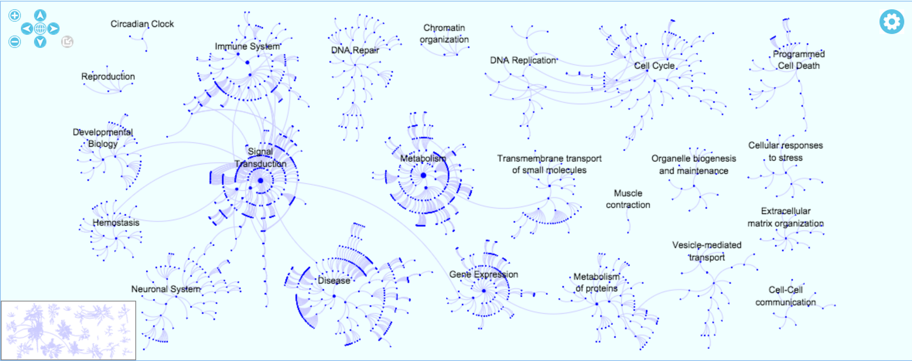

#FIREWORKS WIDGET

##What is it?
A genome-wide, hierarchical visualisation of Reactome pathways in a space-filling graph.

##What is its aim?
  Visualisation of genome-scale pathway analysis results, allowing both a quick “first glance” and rapid zooming in on interesting results.

##Main Features
* Represents the provided Fireworks graph json file in an HTML canvas based view.
* Fireworks automatically fits all the nodes in the initial available area when a graph is loaded.
* Controls on the top left corner of the Fireworks widget allow zooming in and out, fitting the zoom level to adjust the view to the
  available area and also moving the graph up/down/left/right. There is also a button that gets active when a node is selected,
  so by clicking it the action of opening the diagram is triggered.
* The mouse wheel (or similar touch pad actions) allow zooming in or out (always taking into account the mouse position). Mouse wheel
  action is also capturing the scrolling speed, so a strong movement of the wheel accelerates the zooming (in or out) to quickly show
  the final zoom level. Slower mouse wheel scroll will produce small changes of the level of zoom.
* Double clicking or clicking an already selected node (or its pointing edge) also starts an animation to show the effect of opening
  the diagram.
* Moving the mouse while keeping the left button pressed moves the viewport, so hidden areas can be displayed.
* Depending on the level of zoom, more or less information is shown on the screen next to the nodes just to avoid a very text-crowded
  view.
* The widget moves smoothly from node to node when the selection is performed from outside of the widget. The time and the speed are
  depending on the euclidean distance from the centre of the current view to the position and area of the target node.
  The transition movement is linear and goes along with the zoom.
* When the relocation of the view happens, the viewport will always adjust to a level of zoom that allows the user to have a whole
  view of the context of the target pathway.
* The thumbnail in the bottom left corner is interactive and it properly updates its content with the different actions over the
  main display. Once the view is zoomed-in, the thumbnail shows in a box the visible viewport, and by moving this small window in
  the thumbnail, the main viewport changes.
* A "settings" button appears on the top right corner of the viewport and by clicking it a context menu is displayed. There are
  two options available:
    *  Colour profiles: presents a list of colour profiles (named after "the science behind fireworks"). Each of them offers different
       combinations for the standard view and analysis result overlays (explained below).
    *  About Fireworks: shows a window with a short explanation about the widget.

##Analysis Service integration
* This widget is integrated with the Reactome Analysis Service. Therefore after analysing data, the produced analysis "token" can be
  set so the result is displayed as an overlay. Nodes and edges are colored depending on their significance in the particular analysis.
    * When an analysis result is overlaid, the widget shows a control panel on the bottom centre of the viewport and a colours legend
      on the right hand side.
    * For enrichment and species comparison the control panel only contains one button to remove the overlay.
    * For the expression analysis the control panel also includes a mechanism to move through the different time series columns manually
      or automatically by clicking on the "play button". Once is playing the speed of the time series display can also be changed by
      selecting the speed button which gets enabled. Please note that the expression analysis overlay also takes into account the
      pathways significance.
    * For every type of analysis, based on the selected colour profile, the colours legend show lines depending on the significance or
      expression values of the selected/hovered node. For enrichment and species comparison, if the hovered/selected pathway is not
      significant, the line does not appear.
* The analysis result is also overlaid in the thumbnail. Please note that when a time series is "played on" the thumbnail also changes
  as the main view does, so in case of being zoomed in in a specific area, there is still a way of knowing the overall situation.
* If the "play" button is active for the time series, the transitions or padding does not prevent it to happen. Moreover, the previous
  explained feature of the pointers in the legend has been extended to be updated at the same pace.

##Including Fireworks into your GWT project
This Fireworks viewer is implemented in Java using GWT. It is a Maven component that can be included in your GWT project adding the
following dependency into your pom.xml file:

    <dependencies>
        ...
        <dependency>
            <groupId>org.reactome.web</groupId>
            <artifactId>fireworks</artifactId>
            <version>1.0.0</version>
        </dependency>
    </dependencies>

Please note the EBI NEXUS repository has to be added into your repositories:

    <repositories>
        ...
        <repository>
            <id>nexus-ebi-repo</id>
            <name>The EBI internal repository</name>
            <url>http://www.ebi.ac.uk/intact/maven/nexus/content/repositories/ebi-repo/</url>
            <releases>
                <enabled>true</enabled>
            </releases>
            <snapshots>
                <enabled>false</enabled>
            </snapshots>
        </repository>
    </repositories>

In order to instantiate the widget a json file containing the graph is needed. Once it is available by just using the
createFireworksViewer method in the FireworksFactory abstract class a FireworksViewer object is created.

    ...
    String jsonGraph; // Initialise it with one of the species Fireworks json generated in the Server side project
    FireworksViewer fireworks = FireworksFactory.createFireworksViewer(jsonGraph);
    RootLayoutPanel.get().add(fireworks); //Just an example of how to add it to the main root layout panel
    ...

Adding the FireworksViewer object into a panel will start the visualisation.

##Interacting with Fireworks
All the Handlers and actions are available via the [FireworksViewer](src/main/java/org/reactome/web/fireworks/client/FireworksViewer.java)
interface. For example, to get a notification when the user selects a Node, just register a SelectHandler to the Fireworks object:

    ...
    fireworks.addNodeSelectedHandler(new NodeSelectedHandler(){
        @Override
        void onNodeSelected(NodeSelectedEvent event){
            System.out.println(event.getNode());
        }
    });
    ...

To specify to Fireworks to select a node use the method selectNode specifying a valid Node Stable Identifier for the loaded species:

    ...
    fireworks.selectNode("REACT_634");
    ...

##Demo
A working version of Fireworks has been integrated in [Reactome Pathway Browser](http://www.reactome.org/PathwayBrowser/).

##Contact us
You can get in touch with [Reactome](http://www.reactome.org) via email: help[at]reactome.org
